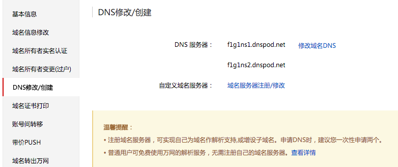

第一次写博客，萌新一个，是按之前的记忆写的，有错误的请指正哈～～ thanks

之前一直是看别人的blog，昨天开始突然想建一个自己的blog，主要用于看一些文档或者别人博客的经验积累；首先就讲下如何建立一个快速搭建GitHub Pages, 之所以选择github pages，是因为这里不仅可以跟他人分享，而且是用强大的git管理；

1. Create a new repository， 创建一个新仓库
    
2.  编辑仓库。, 按步骤一步步下去，最后publish page后， github会自动生成一个首页； 然后可以用http://用户名.github.com/仓库名 访问；
3. 接下来就是配置本地Jekyll了; 注：安装Jekyll时，必须保证ruby版本在2.x.x及以上([安装ruby](https://www.ruby-lang.org/en/downloads/))；
4. 安装Bundler  <pre><code>gem install bundler</code></pre>
5. 将之前在github上创建的newrepo分支pull下来
6. 在newrepo分支下，创建一个Gemfile文件， 加入两行：<pre><code>source 'https://rubygems.org'
gem 'github-pages', group: :jekyll_plugins</code></pre>
7. 命令行输入<pre><code>bundle install</code></pre>
8. 创建Jekyll site；<pre><code>bundle exec jekyll new . --force</code></pre>
9. 更新本地github-pages <pre><code>bundle update github-pages</code></pre>
10. 绑定域名， 创建CNAME文件，内容为siriismyson.com(我的域名)不用加http;
11. ping username.github.io记录下IP地址
12. 然后就是域名解析问题了，我先DNSPod注册了个帐号，然后将万网的的DNS服务器设为<pre><code>f1g1ns1.dnspod.net
f1g1ns2.dnspod.net
</code></pre>

这是DNSPod默认的服务器，然后再在DNSPod中的域名解析中添加两条记录，解析到username.github.io的ip

此时一个默认博客搭建完了， 但是如果没有模版的话，瞬间感觉好屌丝的样子，开始找寻模版了～～
我用的是moon模版，[jekyllthemes下载](http://jekyllthemes.org )。最简单使用模版的方式就是将模版下载好后，直接替换之前的分支，当然最好是在模版中配置下自己的信息啦，然后在_posts目录下开始写你的博客啦～

附上参考链接：https://help.github.com/articles/using-jekyll-as-a-static-site-generator-with-github-pages/ 
